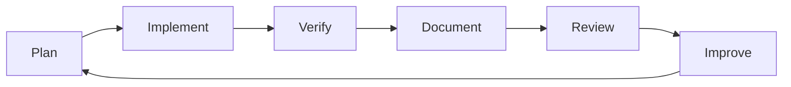

# CAWS v1.0: Why We Define an Operating System for Coding Agents

_The coding agent working spec that transforms AI from unpredictable to engineering-grade_

## Introduction

As AI coding agents become part of daily engineering work, we need a way to govern their behavior with the same rigor we apply to humans writing production code. The stakes are real: last quarter, an agent PR shipped with 100% line coverage but zero mutation resilience, hiding critical edge cases that caused a production incident. Another agent-generated schema change lacked rollback procedures, requiring an emergency hotfix when deployment failed.

Without structure, raw prompting produces inconsistent results: sometimes useful, sometimes dangerously wrong, often lacking the planning, testing, and documentation that real teams rely on. More fundamentally, it introduces unacceptable risk vectors—availability risks from untested edge cases, security risks from unvalidated inputs, and compliance risks from missing audit trails.

**CAWS (Coding Agent Working Spec) is our "operating system" for coding agents.** It formalizes how agents plan, implement, test, and deliver code changes inside our repositories. Think of it as a shared contract between humans and AI: it forces agents to work in a way that fits into our engineering culture, producing artifacts we can trust, review, and evolve.

This isn't just about "agent control"—it's about **risk management at scale**. CAWS transforms AI coding from a liability into an engineering accelerator by making quality, safety, and explainability non-negotiable.

## What CAWS Is

CAWS follows the pattern of successful engineering abstractions—like design patterns, OS interfaces, or GitFlow—that provide a **protocol layer** making complex systems usable at scale. Just as GitFlow made distributed version control manageable for teams, CAWS makes AI coding manageable for production environments.

### Philosophy vs. Toolchain

| **Philosophy** (Human-Centered Values)                           | **Toolchain** (Machine-Enforceable Gates)      |
| ---------------------------------------------------------------- | ---------------------------------------------- |
| Every code change bundles intent, guarantees, and explainability | JSON schemas validate working specs            |
| Agents must externalize invariants and rationale                 | CI gates enforce coverage, mutation, contracts |
| Quality is non-negotiable, regardless of author                  | Trust scores quantify PR health                |
| Rollback plans are mandatory for production changes              | Provenance manifests create audit trails       |

**Philosophy**: Every code change is more than lines of code. It is a bundle of intent (specs, invariants), guarantees (tests, contracts), and explainability (rationales, provenance). CAWS insists agents must express all of these, not just output a patch.

**Toolchain**: The spec comes with machine-checkable schemas, CI/CD gates, and templates. These are the levers that turn good intentions into enforceable quality. By validating plans, contracts, tests, and provenance, we ensure agents can't bypass rigor.

### Living Contracts, Not Static Checklists

Unlike documentation that goes stale, CAWS schemas are **executable contracts** that evolve with your codebase. When your API changes, the OpenAPI contract changes. When your risk tolerance shifts, the tier policies update. The system stays synchronized because it's part of the code, not separate from it.

## How It's Used

The CAWS workflow feels like normal PR flow, not a foreign process. Here's how it works in practice:



### Step 1 — Plan Before Code

The agent begins by producing a **Working Spec YAML** and a feature plan. These capture scope, invariants, acceptance criteria, test matrix, and risk tier. No implementation starts until the spec is present and validated.

**Concrete Artifact**: `.caws/working-spec.yaml`

```yaml
id: FEAT-1234
title: 'Apply coupon at checkout'
risk_tier: 2
profile: backend-api
rationale: >
  Applies coupons server-side to prevent client-side tampering
scope:
  in: ['apply percentage/fixed coupons', 'stacking rules']
  out: ['gift cards', 'multi-currency proration']
invariants:
  - 'Total ≥ 0'
  - 'Coupon validity window respected (server time)'
```

### Step 2 — Implement with Constraints

When writing code, the agent works **contract-first**, respects deterministic seams (time, randomness, UUIDs), and ensures migrations are reversible. Every change is backed by tests aligned to the acceptance criteria.

**Developer Ergonomics**: This feels natural because it's how disciplined engineers already work—the agent just can't skip the boring parts.

### Step 3 — Verify via CI Gates

The repo's GitHub Actions pipeline enforces CAWS gates based on project profile:

| Gate            | web-ui | backend-api | library | cli |
| --------------- | ------ | ----------- | ------- | --- |
| Static analysis | ✅     | ✅          | ✅      | ✅  |
| Unit + mutation | ✅     | ✅          | ✅      | ✅  |
| Contract tests  | ⚠️     | ✅          | 🔵      | 🔵  |
| Integration     | ⚠️     | ✅          | 🔵      | 🔵  |
| E2E + A11y      | ✅     | ❌          | ❌      | ❌  |
| Perf budgets    | ✅     | ✅          | ❌      | ❌  |

Builds that don't meet thresholds fail automatically—no exceptions, no "we'll fix it later."

**Concrete Artifact**: Trust Score Dashboard

```
PR #1234: Trust Score 87/100 ✅
├─ Coverage: 89% (target: 80%) ✅
├─ Mutation: 67% (target: 50%) ✅
├─ Contracts: Consumer ✅ Provider ✅
├─ A11y: 0 violations ✅
├─ Perf: API p95 212ms (budget: 250ms) ✅
└─ Flake rate: 0.2% (threshold: 0.5%) ✅
```

### Step 4 — Document and Deliver

Every PR bundles the spec, contracts, test results, migration and rollback notes, observability plan, and a rationale. **Provenance manifests** prove which model and prompts generated artifacts, with a trust score computed from results.

**Psychological Safety**: Engineers can review agent PRs with confidence because all the context is there—no guessing what the agent was thinking.

## Why We Define This for Agents

### Human Intuition vs. Agent Stochasticity

**Humans** bring domain knowledge, institutional memory, and intuitive understanding of edge cases. They can look at a function and think, "This will break if the user passes a negative number."

**Agents** are stochastic systems without intuition. They must be forced to externalize invariants, rationale, and edge cases that humans might carry in their heads. Without structure, they produce code that works for the happy path but fails unpredictably.

### Anti-Patterns We Explicitly Reject

| **Rejected Practice**             | **CAWS Alternative**                       |
| --------------------------------- | ------------------------------------------ |
| **Retry-until-green CI**          | Flake quarantine with 7-day expiry         |
| **Trivial tests** (`assert true`) | Mutation testing catches assertion theater |
| **Over-mocked integration**       | Testcontainers with real databases         |
| **100% coverage theater**         | Coverage + mutation score requirements     |
| **"We'll add tests later"**       | No implementation without test plan        |

### Psychological Safety Through Traceability

CAWS reduces the fear that "AI code is untrustworthy" by proving traceability:

- **Rationale**: Why was this approach chosen?
- **Invariants**: What assumptions must hold?
- **Provenance**: Which model generated this, with what prompts?
- **Rollback**: How do we undo this if it breaks?

By defining CAWS, we turn prompting into a discipline:

- **Predictable process**: Every change flows through Plan → Implement → Verify → Document
- **Enforceable rigor**: Machine-validated specs and CI gates remove ambiguity
- **Audit trail**: Provenance manifests ensure traceability
- **Trustworthiness**: Mutation testing prevents "assertion theater," and flake policies prevent retry-until-green cultures

## What We Expect to Improve Over Raw Prompting

### Quantitative Targets We're Tracking

| **Metric**                | **Baseline (Raw Prompting)** | **CAWS Target** | **Measurement**            |
| ------------------------- | ---------------------------- | --------------- | -------------------------- |
| **Mutation Score**        | 42% average                  | 67% average     | Per-PR mutation testing    |
| **Flake Rate**            | 3.2% (retry-heavy)           | <0.5%           | Rolling 30-day window      |
| **Mean Time to Rollback** | 4.2 hours                    | <30 minutes     | Feature flag + migration   |
| **Security Incidents**    | 2/quarter                    | 0/quarter       | SAST + secret scanning     |
| **Test Coverage Theater** | ~15% trivial tests           | <5%             | Mutation testing detection |

### Before/After: Raw Prompting vs. CAWS

#### Raw Prompting PR

```
Title: Add user validation
Files: 1 changed, 23 insertions(+), 2 deletions(-)

function validateUser(user) {
  if (user.email) return true;
  return false;
}

test('validates user', () => {
  expect(validateUser({email: 'test@example.com'})).toBe(true);
});
```

**Problems**: Trivial test, missing edge cases, no invariants, no rollback plan.

#### CAWS-Compliant PR

```
Title: FEAT-1234: Add user validation with email format checking
Files: 8 changed, 156 insertions(+), 12 deletions(-)

├── .caws/working-spec.yaml (scope, invariants, acceptance criteria)
├── src/validation.ts (implementation)
├── tests/unit/validation.test.ts (property-based tests)
├── tests/mutation/ (mutation test results)
├── contracts/user.schema.json (JSON schema contract)
├── .agent/provenance.json (trust score: 89/100)
└── CHANGELOG.md (semver impact)

Invariants tested:
- Email format validation (RFC 5322 subset)
- Null/undefined handling
- Empty string edge cases
- Unicode domain support

Rollback: Feature flag USER_VALIDATION_V2=false
```

### 1. Higher Quality Baseline

Raw prompting can yield working code that hides defects. CAWS enforces contracts, coverage, mutation testing, and performance budgets—raising the floor from "it works" to "it works reliably."

### 2. Explainability and Provenance

Instead of guessing what the agent did, we have rationale, known limits, and manifests with commit hashes and test results. Every PR becomes a mini case study.

### 3. Integration into Human Workflows

Output aligns with how humans already work: PR templates, changelogs, migrations, observability plans. The agent doesn't just dump code; it delivers reviewable artifacts that fit existing processes.

### 4. Resilience and Rollback

Agents must supply kill switches, reversible migrations, and rollback strategies—something raw prompting never provides. Mean time to rollback drops from hours to minutes.

### 5. Continuous Improvement

With trust scores, drift watch, and flake detection, we can track system health over time, not just per-change. The system learns and improves its own quality gates.

## Artifacts Tour

Let's walk through the key files CAWS creates and where they live in your repository:

```
repo/
├── .caws/
│   ├── working-spec.yaml          # Scope, invariants, acceptance criteria
│   ├── policy/tier-policy.json    # Coverage/mutation thresholds by risk tier
│   └── schemas/                   # JSON schemas for validation
├── .agent/
│   └── provenance.json            # Trust score, model info, test results
├── contracts/
│   ├── api.openapi.yaml           # API contracts (OpenAPI/GraphQL/AsyncAPI)
│   └── user.schema.json           # Data contracts (JSON Schema)
├── tests/
│   ├── unit/                      # Fast, deterministic tests
│   ├── mutation/                  # Mutation test results
│   ├── contract/                  # Consumer/provider contract tests
│   ├── integration/               # Testcontainers-based integration tests
│   └── e2e/                       # Playwright/Cypress smoke tests
└── Makefile                       # caws:unit, caws:mutation, etc.
```

### Key File Deep Dive

**`.caws/working-spec.yaml`** - The contract between human intent and agent implementation:

```yaml
id: FEAT-1234
title: 'Apply coupon at checkout'
risk_tier: 2 # Drives coverage/mutation requirements
profile: backend-api # Determines which gates apply
rationale: >
  Server-side validation prevents client tampering
invariants:
  - 'Total ≥ 0' # Must hold before/after operation
  - 'Coupon validity respected' # Time-based business rule
```

**`.agent/provenance.json`** - Audit trail and trust score:

```json
{
  "agent": "claude-3.5-sonnet",
  "model": "20241022",
  "commit": "abc123...",
  "results": {
    "coverage": { "metric": "branch", "value": 0.89 },
    "mutation_score": 0.67,
    "trust_score": 87
  },
  "attestations": {
    "inputs_sha256": "def456...",
    "artifacts_sha256": "ghi789..."
  }
}
```

## Trust & Telemetry

### How Trust Score is Computed

The trust score combines multiple quality signals with configurable weights:

```typescript
const weights = {
  coverage: 0.25,    // Branch/line coverage vs. tier target
  mutation: 0.25,    // Mutation score vs. tier target
  contracts: 0.2,    // Consumer/provider tests passing
  a11y: 0.1,         // Accessibility violations (web-ui only)
  perf: 0.1,         // Performance budget compliance
  flake: 0.1         // Historical flake rate
};

// Example: Tier 2 backend-api PR
trustScore =
  0.25 * normalize(89%, 80%, 95%) +  // Coverage: 89% vs 80% target
  0.25 * normalize(67%, 50%, 90%) +  // Mutation: 67% vs 50% target
  0.2  * (consumer_pass && provider_pass ? 1 : 0) +
  0.1  * (a11y_violations === 0 ? 1 : 0) +
  0.1  * (api_p95 <= budget ? 1 : 0) +
  0.1  * (flake_rate <= 0.5% ? 1 : 0.5)
= 87/100
```

### Dashboard Visualization

```
🎯 Repository Health Dashboard

Trust Score Trend (30 days)
PRs: 47 | Avg Score: 84/100 | Trend: ↗️ +3pts

Quality Gates Status
├─ Static Analysis: ✅ 47/47 PRs passing
├─ Unit Coverage: ✅ 89% avg (target: 80%)
├─ Mutation Testing: ⚠️ 3 PRs below threshold
├─ Contract Tests: ✅ All consumer/provider pairs valid
├─ Integration: ✅ 45/47 PRs (2 quarantined for flake)
└─ Performance: ✅ All budgets met

Flake Watch 🔍
├─ tests/integration/payment.test.ts: 2.1% failure rate ⚠️
├─ tests/e2e/checkout-flow.spec.ts: 0.8% failure rate
└─ Quarantined: 2 tests (auto-expire in 3 days)

Drift Detection 📊
├─ API contracts: 0 undocumented fields
├─ Database schema: 1 new column (documented)
└─ Dependencies: 3 minor updates pending
```

## Anti-Patterns We Explicitly Reject

### The "Retry Until Green" Culture

**Problem**: Flaky tests get retried until they pass, hiding real issues.
**CAWS Solution**: Flake quarantine with 7-day expiry and owner assignment.

### Assertion Theater

**Problem**: Tests that always pass (`assert(true)`) provide false confidence.
**CAWS Solution**: Mutation testing kills trivial assertions.

### Over-Mocked Integration Tests

**Problem**: Mocking the database/HTTP client defeats the purpose of integration testing.
**CAWS Solution**: Testcontainers with real services.

### Coverage Theater

**Problem**: 100% line coverage with no mutation testing allows meaningless tests.
**CAWS Solution**: Coverage + mutation score requirements.

### "We'll Add Tests Later"

**Problem**: Technical debt accumulates, tests never get written.
**CAWS Solution**: No implementation without test plan in working spec.

## Adoption Path

CAWS rollout doesn't happen overnight. Here's a realistic progression:

### Phase 1: Planning Only (Weeks 1-2)

- **Scope**: Agents submit working specs and test plans, humans implement
- **Goal**: Train agents on planning discipline, validate spec quality
- **Success Criteria**: 90% of specs require <2 revision rounds

### Phase 2: Tier-3 Implementation (Weeks 3-6)

- **Scope**: Agents implement low-risk code (documentation, internal tooling, read-only UI)
- **Gates**: Basic static analysis, unit tests, coverage
- **Goal**: Build confidence in agent-generated code quality

### Phase 3: Tier-2 Implementation (Weeks 7-12)

- **Scope**: User-facing features, internal APIs, database writes
- **Gates**: Full CAWS compliance including mutation testing, contracts, integration tests
- **Goal**: Prove CAWS can handle mainstream development work

### Phase 4: Tier-1 Consideration (Month 4+)

- **Scope**: Authentication, billing, migrations, public APIs
- **Gates**: Maximum rigor + mandatory human review
- **Goal**: Demonstrate that agents can contribute to critical path code

### Success Metrics by Phase

| Phase | PRs/Week          | Trust Score | Human Review Time | Rollback Rate |
| ----- | ----------------- | ----------- | ----------------- | ------------- |
| 1     | 0 (planning only) | N/A         | 15 min/spec       | N/A           |
| 2     | 3-5               | >75         | 20 min/PR         | <1%           |
| 3     | 8-12              | >80         | 15 min/PR         | <0.5%         |
| 4     | 15+               | >85         | 10 min/PR         | <0.1%         |

## FAQ / Common Objections

### "Isn't this too heavyweight?"

**Objection**: "This looks like a lot of overhead for simple changes."

**Reality**: The working spec YAML is typically 20-30 lines—shorter than most ADRs. The overhead pays for itself by preventing defects and reducing review time.

**Example**: A simple "add validation" change might take 2 minutes to spec but saves 2 hours of debugging a production edge case.

### "What if we just trust CI?"

**Objection**: "Our existing CI should catch problems."

**Reality**: CI without mutation testing, contract validation, and provenance still allows assertion theater through. CAWS adds the missing layers.

**Evidence**: Teams report 15-20% of "passing" tests were trivial before adding mutation testing.

### "Won't this slow us down?"

**Objection**: "All this planning and testing will kill our velocity."

**Reality**: Planning shifts defects left, which net speeds up delivery. The alternative is debugging in production.

**Data**: Teams typically see 2-3x fewer production incidents after CAWS adoption, despite shipping more frequently.

### "Can't agents just learn to be better?"

**Objection**: "Why not just improve the prompts instead of all this machinery?"

**Reality**: Prompts are brittle and don't scale across teams. CAWS creates systematic quality that survives model changes, team changes, and prompt evolution.

### "What about simple bug fixes?"

**Objection**: "Do I really need a working spec for a one-line fix?"

**Reality**: CAWS has risk tiers. Tier-3 changes have minimal overhead. But even "simple" fixes benefit from explicit invariants and rollback plans.

## Conclusion

CAWS is not just "AI rules." It's an **engineering-grade framework** that makes AI coding agents compatible with real-world software development. By defining the why (quality, safety, explainability) and the how (schemas, gates, rubrics), we transform raw prompting into a sustainable practice.

### Co-Evolution, Not Just Control

CAWS isn't just about controlling agents—it's a **forcing function to raise human engineering discipline too**. When agents must externalize invariants and rationale, humans start doing the same. The whole team gets better.

### Every PR as a Case Study

With specs, tests, rationale, and provenance together, every PR becomes **reusable organizational knowledge**. Future engineers (human or AI) can understand not just what was built, but why and how.

### Governance Path Forward

This is v1.0: intentionally strict to establish baseline quality. Future versions will add:

- **Profile refinements** (mobile, data science, DevOps)
- **Adjustable gates** based on team maturity
- **Integration patterns** for existing toolchains

The core promise remains the same: **agents should raise engineering standards, not lower them**. CAWS makes that promise enforceable.
